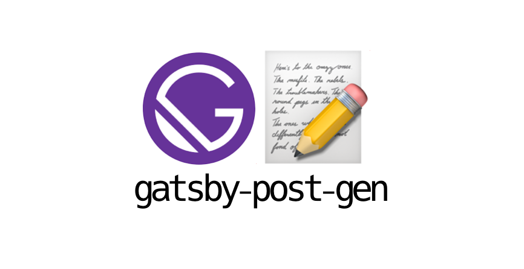

# gatsby-post-gen

 [](https://github.com/semantic-release/semantic-release) [](https://badge.fury.io/js/gatsby-post-gen)

Generate post of blog based gatsby framework.

Using in [gatsby-starter-bee](https://github.com/JaeYeopHan/gatsby-starter-bee)

## 🚚 Install

```sh
npm install -D gatsby-post-gen
# yarn add -D gatsby-post-gen
```

_package.json_

```json
"scripts": {
  "create": "gatsby-post-gen",
}
```

```sh
npm run create # Create blog post to `.md` file
```

## LICENSE

[MIT](./LICENSE)

<div align="center">

<sub><sup>Project by <a href="https://github.com/JaeYeopHan">@Jbee</a></sup></sub><small>✌</small>

</div>
